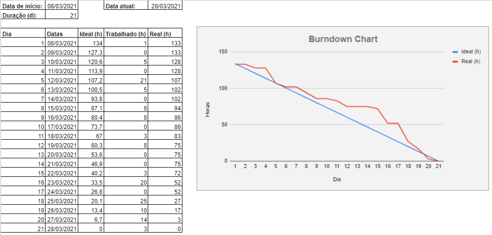

 

<h1 align="center"> Sprint 1: 08/03/2021 a 28/03/2021 </h1>

 
    <a href="#objetivos">Objetivos da Sprint</a> | 
    <a href="#levantamento">Levantamento de Requisitos</a> | 
    <a href="#wireframe">Wireframe</a> | 
    <a href="#prototipo">Protótipo</a> | 
    <a href="#org-equipe">Organização da Equipe</a> | 
    <a href="#org-repo">Organização do Repositório</a> | 
    <a href="#tag">Tag: sprint-01</a>

   
Sendo a primeira sprint, definimos e realizamos as tarefas mais importantes para o início do projeto, todas com características de planejamento e gerenciamento do produto e do processo, além de outras esferas como a organização da equipe e das ferramentas e tecnologias que seriam usadas ao decorrer das sprints.

## :dart: Objetivos da Sprint
Num olhar geral, é possível organizar as atividades realizadas em prol de 5 objetivos:
  - Levantamento de requisitos, para delimitação de escopo;
  - Organização da equipe, para transparência e planejamento de processos;
  - Confecção do wireframe, um rascunho do protótipo a fim de validação do cliente;
  - Desenvolvimento do protótipo, com o intuito de exemplificar o produto final e suas funcionalidades;
  - Organização do repósitório remoto, para trabalhar em equipe manipulando os mesmos arquivos de forma padronizada. 

→ [Voltar ao topo](#topo)

## :pencil: Levantamento de Requisitos
Antes de desenvolver o projeto, foi preciso denifir os desejos do cliente, organizando-os de acordo com suas prioridades e documentando com técnicas de Engenharia de Software. Para este levantamento de requisitos, o Scrum Master do grupo esteve em contato constante com o cliente, questionando suas vontades e necessidades a fim de esculpir um plano de ação que satisfazesse seus pedidos, na medida do possível. Dessa forma, foi criado um backlog do produto, contendo suas funcionalidades e características principais, além de sprint backlogs e user stories, que são itens complementares para auxiliar a organização da equipe em relação às tarefas a serem desenvolvidas.
- :pushpin: Para verificar os backlogs das sprints e do produto, [clique aqui](https://github.com/Equipe-01-DSM-2021/projeto-integrador-2021-1).

→ [Voltar ao topo](#topo)

## :pencil2: Wireframe
A confecção do wireframe foi iniciada assim que alguns dos requisitos principais foram validados com o cliente através de user stories. Essa tarefa foi feita na ferramenta de prototipação gratuita [Figma](http://www.figma.com), onde o resultado é considerado um rascunho do protótipo que seria entregue ao fim da sprint, por isso é desprovido de cores, logos ou todas as interações. Observe uma demonstração do wireframe abaixo, porém também é possível achar seus arquivos em PDF ou recortes de cada interface clicando [aqui](/prototipo).

### Demonstração do Wireframe

→ [Voltar ao topo](#topo)

## :desktop_computer: Protótipo
Depois da definição do wireframe, iniciou-se o trabalho de codificação, passando os desenhos para arquivos HTML e CSS, adicionando interações usando scripts de JavaScript. O protótipo já conta com cores, tipografia e exemplos do resultado de uma busca, proporcionando a experiência esperada que o usuário terá ao manipular o produto final. 

- A primeira fase do protótipo dinâmico foi realizada também com a utilização do Figma, onde é possível acessar o protótipo por meio [deste link](https://www.figma.com/file/bgsXLk2bXJIwo5SOnUhylt/API-2021%2F1?node-id=1%3A886).
- A segunda fase foi o desenvolvimento do projeto em HTML, CSS e JavaScript, com a exibição de gráficos com dados fictícios utilizando uma biblioteca do JavaScript chamada [Chart.js](https://www.chartjs.org/). Observe o resultado gerado pelos códigos na demonstração abaixo:

### Demonstração do Protótipo

→ [Voltar ao topo](#topo)

	
## :busts_in_silhouette: Organização da Equipe
Para melhor organização do projeto, foi levantado as habilidades técnicas da equipe assim que decididas as ferramentas e tecnologias que seriam usadas, dividindo provisoriamente os integrantes em dois times principais: time Frontend e time backend, cada um com responsabilidades distintas mas sempre em comunicação. A princípio, o time Frontend focou em aprender mais sobre HTML, CSS e JavaScript, enquanto que a capitã deste time lidava com as bibliotecas JavaScript, já no time Backend, o time se focou em relacionar os dados que tínhamos a disposição, procurando inclusive outras bases de dados e explorando funcionalidades de bibliorecas Python enquanto realizaram testes com a ferramenta [Jupyter Notebook](https://jupyter.org/) e manipulação de arquivos CSV com o [Orange](https://orangedatamining.com/).
- A documentação e acompanhamento de atividades ficou a cargo da Scrum Master da equipe, que também colaborava com os dois times de trabalho.
  - Observe adiante o gráfico Burndown gerado pela equipe nesta primeira sprint, onde o eixo X são os dias trabalhados na sprint e os valores do eixo Y representam as entregas e esforços realizados com o passar do tempo.
 

→ [Voltar ao topo](#topo)

## :file_folder: Organização do Repositório
Tendo em vista o trabalho remoto que a equipe teria que se encaixar, foram definidos alguns padrões para a configuração do ambiente de trabalho compartilhado sempre se manter organizado, garantindo transparência e fácil acesso ao que se deseja a qualquer um de interesse.

→ [Voltar ao topo](#topo)

## :label: Tag: sprint-01
Para marcar a entrega feita na primeira sprint, foi criada uma tag neste repositório com o nome "sprint-01", que corresponde ao estado em que se encontra o projeto do dia da entrega, ou seja, dia 28/03/2021. Com a tag, sempre será possível visualizar como estava o repositório ao fim da primeira sprint, por mais que o projeto sofra alterações, pois tags em si não são mutáveis conforme o tempo, sendo a maneira escolhida pelo time para sinalizar as entregas até o fim do projeto.

→ [Voltar ao topo](#topo)
